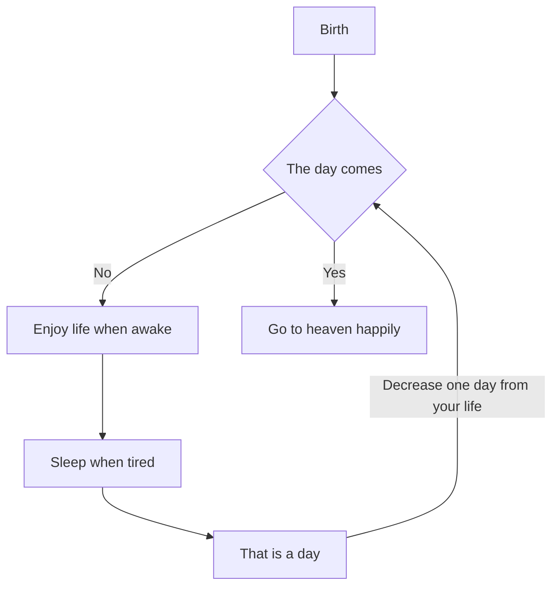
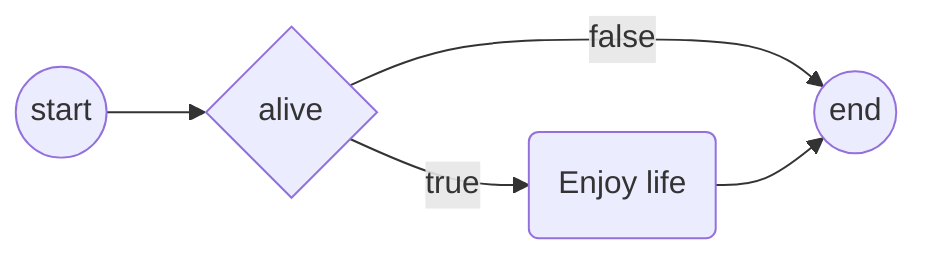
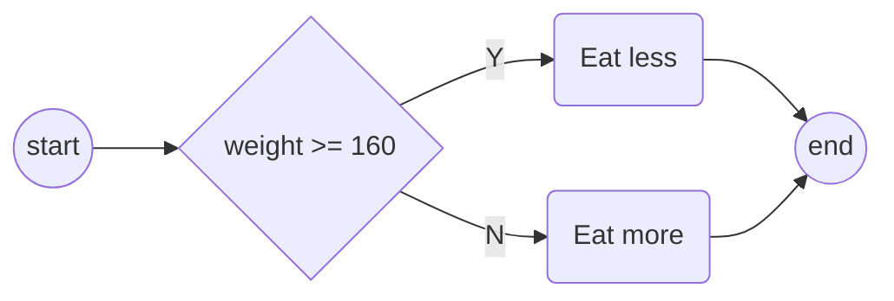
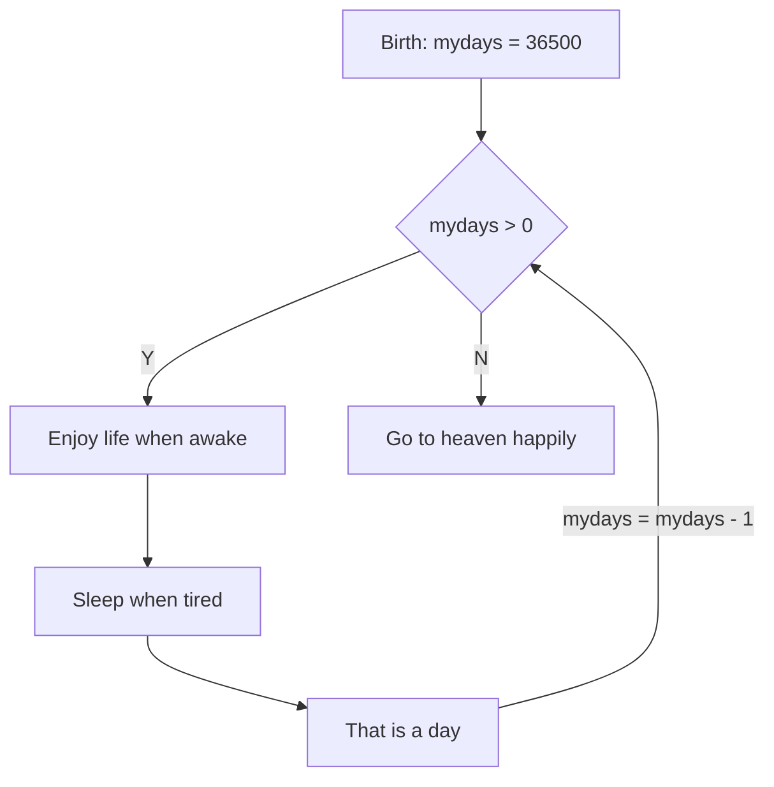

__Formatted Input/Output__

_chtp9e ch9_


Solve problems with algorithms
---
- An algorithm is a procedure for solving a problem in terms of
  - the actions (functions) to execute, and
  - the order (flowchart) in which these actions should execute
    - sequential execution
    - transfer of control
      - goto statement
        - goto elimination
    - control structures
      - sequence structure
      - selection structure
        - _if_ single-selection statement
        - _if...else_ double selection statement
        - _switch_ multiple-selection statement
      - iteration structure
        - _while_ statement
        - _do...while_ statement
        - _for_ statement
- Pseudocode is used to draft algorithms

💡 Demo: draw flowchart with [Mermaid](https://mermaid.js.org/syntax/flowchart.html)
---
- A simple life


📝 Practice
---
- Draw the simple life flowchart in [live Mermaid](https://mermaid.live/)


_if_ statement
---
```c
if (alive == true){
  puts("Enjoy your life!");
}

// equivalent to
if (alive == true)
  puts("Enjoy your life!");

// or
if (alive == true) puts("Enjoy your life!");
```



_if...else_ statement
---
```c
if (weight > 160) {
  puts("Eat less");
} 
else {
  puts("Eat more");
}
// equivalent to the conditional operator (?:) express
puts((weight>160)?"Eat less":"Eat more");
```



Nested if...else statements
---
```c
if (grade >= 90)
{
  puts("A");
} 
else
{
  if (grade >= 80)
  {
    puts("B");
  } 
  else
  {
    if (grade >= 70)
    {
      puts("C");
    } 
    else
    {
      if (grade >= 60)
      {
        puts("D");
      } 
      else
      {
        puts("F");
      } 
    }   
  }     
} 
// equivalent to
if (grade >= 90)
{
  puts("A");
} 
else if (grade >= 80)
{
  puts("B");
} 
else if (grade >= 70)
{
  puts("C");
} 
else if (grade >= 60)
{
  puts("D");
} 
else
{
  puts("F");
} 
```


Blocks and Compound Statements
---
- A set of statements contained within a pair of braces is called a _compound statement_ or a _block_ 
- A compound statement can be used like a single statement

```c
// can the braces be removed?
if (grade >= 60)
{
  puts("Passed.");
} 
else
{
  puts("Failed.");
  puts("You must take this course again.");
} 
```

Empty statement
---
- a typical logical error
  ```c
  if (alive);
  {
    puts("Enjoy life.");
  }
  ```


The _while_ iteration statement
---
```c
int mydays = 36500;
while(mydays > 0){ // counter controlled iteration
  puts("Enjoy life while awake.");
  puts("Sleep while tired.");
  puts("That is a day.");

  mydays = mydays - 1;
}
puts("Go to heaven happily.");
```



Formulate algorithms with Top-Down
---
```c
#include <stdio.h>

int main(void) { 
   int total = 0; 
   int counter = 1; 

   while (counter <= 10) { 
      printf("%s", "Enter grade: "); 
      int grade = 0; 
      scanf("%d", &grade); 
      total = total + grade; 
      counter = counter + 1; 
   } 

   int average = total / 10; 
   printf("Class average is %d\n", average); 
} 
```

📝 Practice
---
- counter-controlled iteration for definite iteration
- An uninitialized variable contains a _“garbage” value_
  - change 'int total=0' to be 'int total' above to see what happened


Sentinel-Controlled Iteration
---
- a _sentinel value_ is used to indicate “end of data entry.”
  - also called  a signal value, a dummy value, or a flag value.
  - used for _indefinite_ iteration

```c
#include <stdio.h>

int main(void)
{

  int total = 0;
  int counter = 0;

  printf("%s", "Enter grade, -1 to end: ");
  int grade = 0;
  scanf("%d", &grade);

  // What is the sentinel value?
  while (grade != -1)
  {
    total = total + grade;
    counter = counter + 1;

    printf("%s", "Enter grade, -1 to end: ");
    scanf("%d", &grade);
  }

  if (counter != 0)
  {
    double average = (double)total / counter;
    printf("Class average is %.2f\n", average);
  }
  else
  {
    puts("No grades were entered");
  }
}
```