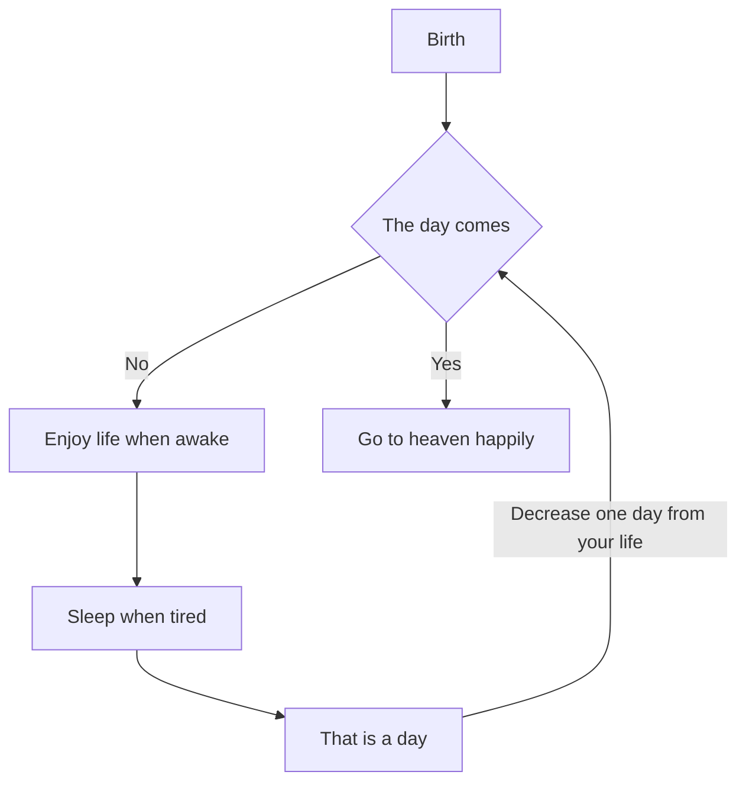
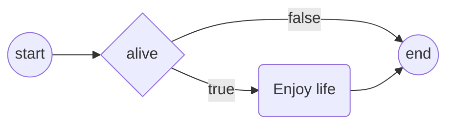
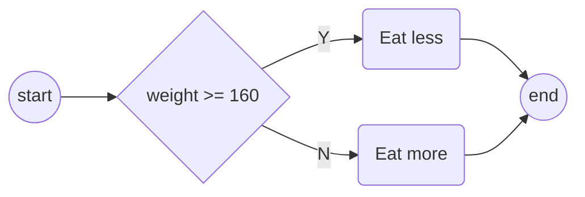
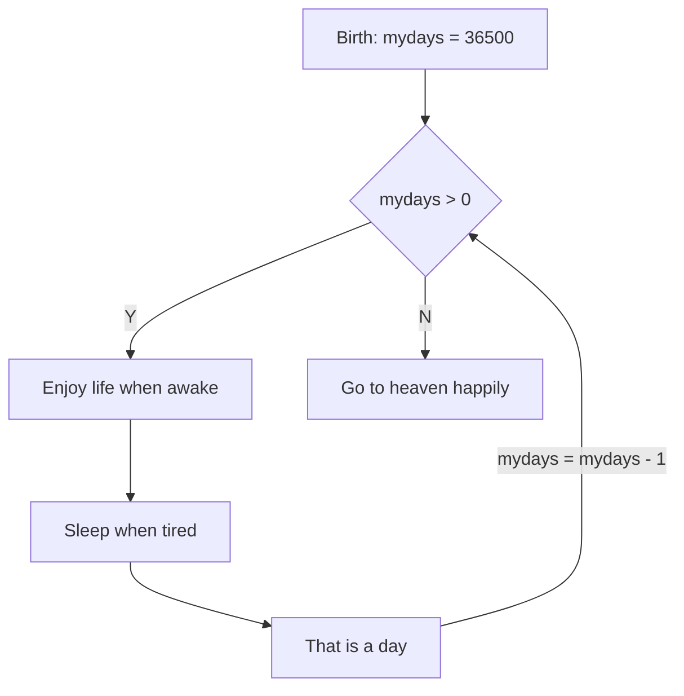

__Structured Program Development__

_chtp9e ch3_

Solve problems with algorithms
---
- An algorithm is a procedure for solving a problem in terms of
  - the actions (functions) to execute, and
  - the order (flowchart) in which these actions should execute
    - sequential execution
    - transfer of control
      - goto statement
        - goto elimination
    - control structures
      - sequence structure
      - selection structure
        - _if_ single-selection statement
        - _if...else_ double selection statement
        - _switch_ multiple-selection statement
      - iteration structure
        - _while_ statement
        - _do...while_ statement
        - _for_ statement
- Pseudocode is used to draft algorithms

💡 Demo: draw flowchart with [Mermaid](https://mermaid.js.org/syntax/flowchart.html)
---
- A simple life


📝 Practice
---
- Draw the simple life flowchart in [live Mermaid](https://mermaid.live/)


_if_ statement
---
```c
if (alive == true){
  puts("Enjoy your life!");
}

// equivalent to
if (alive == true)
  puts("Enjoy your life!");

// or
if (alive == true) puts("Enjoy your life!");
```



_if...else_ statement
---
```c
if (weight > 160) {
  puts("Eat less");
} 
else {
  puts("Eat more");
}
// equivalent to the conditional operator (?:) express
puts((weight>160)?"Eat less":"Eat more");
```



Nested if...else statements
---
```c
if (grade >= 90)
{
  puts("A");
} 
else
{
  if (grade >= 80)
  {
    puts("B");
  } 
  else
  {
    if (grade >= 70)
    {
      puts("C");
    } 
    else
    {
      if (grade >= 60)
      {
        puts("D");
      } 
      else
      {
        puts("F");
      } 
    }   
  }     
} 
// equivalent to
if (grade >= 90)
{
  puts("A");
} 
else if (grade >= 80)
{
  puts("B");
} 
else if (grade >= 70)
{
  puts("C");
} 
else if (grade >= 60)
{
  puts("D");
} 
else
{
  puts("F");
} 
```


Blocks and Compound Statements
---
- A set of statements contained within a pair of braces is called a _compound statement_ or a _block_ 
- A compound statement can be used like a single statement

```c
// can the braces be removed?
if (grade >= 60)
{
  puts("Passed.");
} 
else
{
  puts("Failed.");
  puts("You must take this course again.");
} 
```

Empty statement
---
- a typical logical error
  ```c
  if (alive);
  {
    puts("Enjoy life.");
  }
  ```


The _while_ iteration statement
---
```c
int mydays = 36500;
while(mydays > 0){ // counter controlled iteration
  puts("Enjoy life while awake.");
  puts("Sleep while tired.");
  puts("That is a day.");

  mydays = mydays - 1;
}
puts("Go to heaven happily.");
```



Formulate algorithms with Top-Down
---
```c
#include <stdio.h>

int main(void) { 
   int total = 0; 
   int counter = 1; 

   while (counter <= 10) { 
      printf("%s", "Enter grade: "); 
      int grade = 0; 
      scanf("%d", &grade); 
      total = total + grade; 
      counter = counter + 1; 
   } 

   int average = total / 10; 
   printf("Class average is %d\n", average); 
} 
```

📝 Practice
---
- counter-controlled iteration for definite iteration
- An uninitialized variable contains a _“garbage” value_
  - change 'int total=0' to be 'int total' above to see what will happen


Sentinel-Controlled Iteration
---
- a _sentinel value_ is used to indicate “end of data entry.”
  - also called  a signal value, a dummy value, or a flag value.
  - used for _indefinite_ iteration

```c
#include <stdio.h>

int main(void)
{

  int total = 0;
  int counter = 0;

  printf("%s", "Enter grade, -1 to end: ");
  int grade = 0;
  scanf("%d", &grade);

  // What is the sentinel value?
  while (grade != -1)
  {
    total = total + grade;
    counter = counter + 1;

    printf("%s", "Enter grade, -1 to end: ");
    scanf("%d", &grade);
  }

  if (counter != 0)
  {
    // explicit conversion of data types
    double average = (double)total / counter;
    printf("Class average is %.2f\n", average);
  }
  else
  {
    puts("No grades were entered");
  }
}
```

Converting Between Types Explicitly and Implicitly
---
- Integer division truncates any fractional part of the result
- Keep the fractional part with explicit conversion to real number type _double_
- explicit conversion by unary _cast operator_: $(T)v$
  - convert variable v's type to type $T$
- implicit conversion: a = b
  - no problem if a's type is wider (has more bits) than b's type
  - losing accuracy or causing _error of overflow_ otherwise
- other two popular unary operators
  - plus (+) can be used as positive operator
  - minus (-) as negative operator


💡 Demo: Format floating-point numbers
---
- Recall the [printf format string](https://cplusplus.com/reference/cstdio/printf/)
  - `%[flags][width][.precision][length]specifier`
```c
#include <stdio.h>

int main(void){
    double pi = 3.141592653589793115997963468544185161590576171875;

    printf("pi = %.2f\n", pi);
    printf("pi = %.4f\n", pi);
    printf("pi = %f\n", pi); // what is the default precision?
    printf("pi = %.40f\n", pi); // what is the maximum precision?

    printf("pi = %5.5f\n", pi);
    printf("pi = %10.5f\n", pi);
    printf("pi = %010.5f\n", pi);

    return 0;
}
```


⚠️ Limitations of floating-point numbers
---
- floating-point data types has limited space
  - float has 4 bytes with about 7 significant digits
  - double has 8 bytes with about 15 significant digits
- so they can only be an approximation of real numbers with too many even infinite digits
  - $\displaystyle \frac{1}{3}=0.\dot{3}$
- even worse, binary number can't represent may decimal numbers precisely, called _representation error_, such as
  - 0.1 ≈ 0.1000000000000000055511151231257827021181583404541015625 
  - 0.3 + 0.6 ≈ 0.89999999999999991
- Do not compare floating-point values for equality
  - abs(a-b) < a very small number may be used
  - this small value could be FLT_EPSILON, DBL_EPSILON, LDBL_EPSILON defined in _float.h_


Nested control statements
---
- What we are doing in this program?
```c
#include <stdio.h>
int main(void) {
   
   int passes = 0; 
   int failures = 0; 
   int student = 1;  
   
   while (student <= 10) {
      
      printf("%s", "Enter result (1=pass,2=fail): ");
      int result = 0; 
      scanf("%d", &result);
      
      if (result == 1) {     
         passes = passes + 1;
      } 
      else { 
         failures = failures + 1;
      } 
      student = student + 1; 
   } 
   
   printf("Passed %d\n", passes);
   printf("Failed %d\n", failures);
   
   if (passes > 8) {
      puts("Bonus to instructor!");
   } 
} 
```


Assignment operators
---
- single assignment: $x = v$
- compound assignment: $x ㊁= v$ which is equivalent to $x = x ㊁ v$
  - ㊁ is a binary operator such as +,-,*,/, etc.


📝 Practice
---
- Use [assignment operators](https://en.cppreference.com/w/c/language/operator_assignment)


[Increment and decrement operators](https://en.cppreference.com/w/c/language/operator_incdec)
---
- they are unary operators with two forms
  - preincrement (++v) and postincrement (v++)
  - predecrement (--v) and postdecrement (v--)
- increment operator adds an integer variable by one
- decrement operator subtracts an integer variable by one


💡Demo
---
- find the result for each printf
```c
#include <stdio.h>

int main(void)
{

  int c = 5;

  printf("%d\n", c);
  printf("%d\n", c++);
  printf("%d\n", c);
  printf("%d\n", ++c);
  printf("%d\n", c);
  printf("%d\n", c--);
  printf("%d\n", c);
  printf("%d\n", ++c);
  printf("%d\n\n", c);
}
```


👀 Review
---
- [C Operator Precedence](https://en.cppreference.com/w/c/language/operator_precedence)


🔭 Explore
---
- [data types of number](https://en.cppreference.com/w/c/language/arithmetic_types)
  - [integer limits](https://cplusplus.com/reference/climits/)
  - [floating number limits](https://cplusplus.com/reference/cfloat/)
    - [IEEE 754](https://en.wikipedia.org/wiki/IEEE_754)
    - [Floating point](https://simple.wikipedia.org/wiki/Floating_point)
      - [Single-precision floating-point format](https://en.wikipedia.org/wiki/Single-precision_floating-point_format)
      - [Double-precision floating-point format](https://en.wikipedia.org/wiki/Double-precision_floating-point_format)
- [How to specify the format string for each data type?](https://cplusplus.com/reference/cstdio/printf/)


# References
- [Is FLT_RADIX ever not 2 in C11 for modern general purpose computers?](https://stackoverflow.com/questions/29174165/is-flt-radix-ever-not-2-in-c11-for-modern-general-purpose-computers)
- [Difference between upper and lower case double (float) type specifiers in C](https://stackoverflow.com/questions/34706228/difference-between-upper-and-lower-case-double-float-type-specifiers-in-c)
- [Floating Point Arithmetic: Issues and Limitations](https://docs.python.org/3/tutorial/floatingpoint.html)
  - [Why 0.1 Does Not Exist In Floating-Point](https://www.exploringbinary.com/why-0-point-1-does-not-exist-in-floating-point/)
  - [Machine epsilon](https://en.wikipedia.org/wiki/Machine_epsilon)
- [1000 digits of pi in Python](https://stackoverflow.com/questions/9004789/1000-digits-of-pi-in-python)