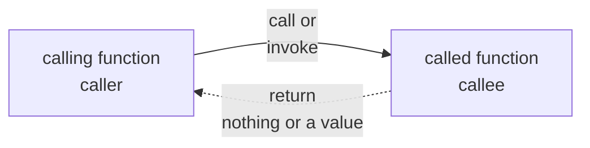

__Functions__

_chtp9e ch5_

Modularizing programs in C
---
- A C program can be decomposed into parts
  - each part fulfills a simple task or function
  - each part is easy to implement and test
  - in C, these parts can be abstracted and implemented as functions, e.g
    - printf: formatted print
    - scanf: formatted input
  - functions are collected in libraries, e.g. the standard C library
    - the details of function implementation are hidden
    - function prototype states how a function can be used
- Improve software reuse
  - Avoids reinventing the wheel


Function call
---
- used to invoke function
- specifies function name and the required input
- the function output, returned value is what we need
- A calling function (caller) calls a called function (callee)



Math library functions
---
- collected in C math library with header `math.h`
- provide common mathematical functions, constants and types


📝 Practice
---
- Find the following mathematical functions in [math.h](https://en.cppreference.com/w/c/numeric/math)
  - pow(x,y) = $x^y$, sqrt(x) = $√x$, cbrt(x) = $∛x$, exp(x) = $e^x$
  - log(x) = $\ln x$, log10(x) = $\log_{10}x$, fabs(x) = $|x|$ 
  - ceil(x) = $⌈x⌉$, floor(x) = $⌊x⌋$, fmod(x, y) = $x \mod y$
  - sin(x) = $\sin x$, cos(x) = $\cos x$, tan(x) = $\tan x$
  - the data types of the parameters and return values are _double_
- Write a program to test these functions
```c
#include <stdio.h>
#include <math.h>

int main(void){
  double x,y;

  printf("Please enter two numbers: ");
  scanf("%lg%lg", &x, &y);

  printf("sqrt(%lg)=%lg\n", x, sqrt(x));
  printf("cbrt(%lg)=%lg\n", x, cbrt(x));
  printf("exp(%lg)=%lg\n", x, exp(x));
  printf("log(%lg)=%lg\n", x, log(x));
  printf("log10(%lg)=%lg\n", x, log10(x));

  printf("fabs(%lg)=%lg\n", x, fabs(x));
  printf("ceil(%lg)=%lg\n", x, ceil(x));
  printf("floor(%lg)=%lg\n", x, floor(x));

  printf("sin(%lg)=%lg\n", x, sin(x));
  printf("cos(%lg)=%lg\n", x, cos(x));
  printf("tan(%lg)=%lg\n", x, tan(x));

  printf("pow(%lg,%lg)=%lg\n", x, y, pow(x,y));
  printf("fmod(%lg,%lg)=%lg\n", x, y, fmod(x,y));
}
```

Function definition
---
```c
#include <stdio.h>

int square(int number); // ❶ function prototype

int main(void)
{
   for (int x = 1; x <= 10; ++x)
   {
      printf("%d  ", square(x)); // ❸ function invocation
   }

   puts("");
}

int square(int number) // ❷ function definition: header followed by body
{
   return number * number;
}
```
- explain: `return-value-type function-name(parameter-list){statements}`
  - function header and body
  - function declaration (prototype) and definition
  - formal parameters and actual parameters
  - local variables
  - return statement
    - `return;` returns nothing
    - `return expression;` returns the value of expression
- main's return type, value, and meaning
  - type is `int`
  - 0 means main ran successfully
  - non-zero indicates errors occurred
  - `return 0;` will be added implicitly by the compiler if it is missing


📝 Practice
---
- Explain the function `maximum`
  
```c
#include <stdio.h>

// ❶ in function prototype, parameter names are ignored by the compiler
// so the form below is valid
int maximum(int, int, int);

int main(void)
{
   int number1 = 0;
   int number2 = 0;
   int number3 = 0;

   printf("%s", "Enter three integers: ");
   scanf("%d%d%d", &number1, &number2, &number3);

   printf("The maximum of (%d,%d,%d) is: %d\n", 
                          number1, number2, number3, 
                          maximum(number1, number2, number3));
}

int maximum(int x, int y, int z)
{
   int max = x;

   if (y > max)
   {
      max = y;
   }

   if (z > max)
   {
      max = z;
   }

   return max;
}
```

Function prototypes
---
- used by C's type-checking capabilities
  - to check whether a function call matches the function prototype
    - compilation error occurs in no match
- formal parameter names are ignored by the compiler
  - so `int maximum(int, int, int)` is valid
- perform _argument coercion_ automatically
  - implicitly convert arguments to the declared type
  - integer types to floating-point types: no value lose
  - floating-point types to integer types: fraction is truncated
- Without prototype, the compiler forms one from 
  - the first occurrence of the function
    - either the function definition
    - or a call to the function, typically leads to compiler warnings or errors

| Data type | Format string |
| --- | --- |
| long double | `%Lf` |
| double | `%lf` |
| float | `%f` |
| unsigned long long int | `%llu` |
| long long int | `%lld` |
| unsigned long  int | `%lu` |
| long  int | `%ld` |
| unsigned  int | `%u` |
| int | `%d` |
| unsigned  short | `%hu` |
| short | `%hd` |
| char | `%c` |

- C’s usual arithmetic conversion rules minimize value lose
  - convert every type to the “highest” type in mixed-type expressions
  - handled by the compiler
- A cast operator is needed to convert lower type to higher type explicitly


📝 Practice
---
- Run the program then explain the output

```c
#include <stdio.h>

int toint(int x){
  return x;
}
double todouble(double x){
  return x;
}

int main(){
  int x; 
  double y;

  printf("Enter an integer and a double: ");
  scanf("%d%lf", &x, &y);
  printf("int %d to double %lf\n", x, todouble(x));
  printf("double %lf to int %d\n", y, toint(y));
}
```

💡 Demo
---
- Demonstrate function-call stack and stack frames
- Stack overflow

```c
#include <stdio.h>

int square(int x);

int main()
{
  int a = 10;
  printf("%d squared: %d\n", a, square(a));
}

int square(int x)
{
  return x * x;
}
```

Header files of libraries
---
- header files contain collections function prototypes, data types and constants
  - serve as Application Programming Interface (API)
- libraries contain the function definitions


🔭 Explore
---
- [The headers of the C standard library](https://en.cppreference.com/w/c/header)


Pass arguments by value and by reference
---
- all arguments are passed by value
  - formal parameter = actual parameter
  - changes to formal parameter has no effect on the actual parameter
- pass by reference can be achieved with pointer
  - array arguments are pointers


Generate random number
---
- widely used in simulation and game playing
- a random integer value can be obtained using `int rand()` defined in `<stdlib.h>`
  - range: 0 to RAND_MAX (at least 32767)
  - the sequence generated can be repeated with the same seed set by `srand(seed)`
  - a good idea to randomize the seed each run time `srand(time(NULL))`
- generate random integers between a and b: `int n = a + rand()%b`
- generate random real numbers between 0 and 1: `double r = (double)rand()/RAND_MAX`

```c
#include <stdio.h>
#include <stdlib.h>
 
int main(void) {
  printf("RAND_MAX = %d\n", RAND_MAX);
  
  // rolling a six-sided die
  for (int i = 1; i <= 10; ++i) { 
    printf("%d  ", 1 + (rand() % 6)); 
  } 

  puts("");
}
```


📝 Practice: build a Casino game
---
- equipments: two six-faces dice, these faces have 1-6 spots
- play: throw the two dice and wait them come to rest
- rules: based on the sum of the spots on the two upward faces
  - win if the sum is 7 or 11 on the first throw
  - lose if the sum is 2,3, or 12 on the first throw
  - use the sum as a win points if the sum is 4,5,6,8,9 or 10 on the first throw
    - continue throwing to win if get the win points
    - lose if rolling a 7
- compile, run and play [the game](../chtp9ecode/ch05/fig05_07.c)


Enumerations
---
- model finite number of status with symbolic names
  - e.g. the game status
  - make programs more readable and maintainable
- created with keyword `enum`: `enum enumeration_name {list of symbolic names}`


[Storage classes](https://en.cppreference.com/w/c/language/storage_duration)
---
- determine an identifier’s 
  - storage duration: the period during which an identifier exists in memory
  - scope: where a program can reference an identifier
  - linkage: whether the identifier is known
    - only in the current scope 
    - or in any other scope with proper declarations
- specified with 
  - automatic duration: `auto, register`
    - used on variables only
  - static duration: ` extern, static`
    - used on variables and functions


Local variables
---
- reside in blocks, function's parameter list or body 
  - exist while the block is active
  - destroyed when program control (pc) exits the block
- have automatic storage duration by default
  - so the keyword `auto` is rarely explicitly used
- managed using stack


static storage class
---
- static variables and functions exist from program start to end
- storage is allocated and initialized for static variables only once
  - _before the program begins execution_
- Global variables and function names have storage class extern by default
  - can be referenced by any function that follows their declaration
    - so global variables can be modified accidentally
      - use local variable instead of global variable if possible
- Local static variables are known only in their residing functions
  - retain values across function calls
- All numeric variables of static storage are initialized to zero by default


[Scope rules](https://en.cppreference.com/w/c/language/scope)
---
```c
#include <stdio.h>

void useLocal(void); 
void useStaticLocal(void); 
void useGlobal(void); 

int x = 1; 

int main(void) {
   int x = 5; 

   printf("local x in outer scope of main is %d\n", x);

   { 
      int x = 7; 
                                                           
      printf("local x in inner scope of main is %d\n", x); 
   } 

   printf("local x in outer scope of main is %d\n", x);

   useLocal(); 
   useStaticLocal(); 
   useGlobal(); 

   useLocal(); 
   useStaticLocal(); 
   useGlobal(); 

   printf("\nlocal x in main is %d\n", x);
} 

void useLocal(void) {
   int x = 25; 

   printf("\nlocal x in useLocal is %d after entering useLocal\n", x);
   ++x;
   printf("local x in useLocal is %d before exiting useLocal\n", x);
} 

void useStaticLocal(void) {
   static int x = 50; 

   printf("\nlocal static x is %d on entering useStaticLocal\n", x);
   ++x;
   printf("local static x is %d on exiting useStaticLocal\n", x);
} 

void useGlobal(void) {
   printf("\nglobal x is %d on entering useGlobal\n", x);
   x *= 10;
   printf("global x is %d on exiting useGlobal\n", x);
} 
```

- The _scope of an identifier_ is the portion of the program in which the identifier can be referenced
- four identifier scopes
  - function scope
    - labels are the only identifiers with this scope
  - function prototype scope
    - applies only to those identifiers in the function parameter list
    - these identifiers can be reused elsewhere since the compiler ignores them
  - block scope
    - Identifiers defined inside a block have this scope
      - function parameters are considered this function's local variables
      - identifiers with same name may exist in nested blocks
        - each refers to the one in its own block
    - Local variables declared static still have block scope
      - even though they exist from before program startup
      - storage duration does not affect the scope of an identifier
  - file scope
    - An identifier declared outside any function has this scope
      - known in all functions 
        - from the point at which the identifier is declared 
        - until the end of the file
      - such as 
        - global variables, 
        - function definitions, 
        - and function prototypes placed outside a function


Recursion
---
- calculate factorial of $n, (n\ge 0)$
  - ➀ definition: $\displaystyle n! = n×(n-1)×⋯×2×1 = Π_{k=1}^nk$
  - ❶ base case: $0! = 1! = 1$
  - ❷ recursive step: $\displaystyle n! = n×(n-1)!$
```c
#include <stdio.h>
#include <limits.h>

unsigned long long int factoriali(int n); // 🄋 iterative
unsigned long long int factorial(int n); // ⓿ recursive

int main(void) {
   
   for (int i = 0; i <= 22; ++i) {
      printf("%2d! = %20llu | %20llu\n", i, factoriali(i), factorial(i));
   }
   printf("max unsigned long long int = %llu\n", ULLONG_MAX);
} 

// 🄋 iterative
unsigned long long int factoriali(int n){
  unsigned long long int f = 1;

  for(int k=n; k>=1; k--){// ➀ definition
    f *= k;
  }
  
  return f;
}
// ⓿ recursive
unsigned long long int factorial(int n) { 
   if (n <= 1) { // ❶ base case
      return 1;                                
   }                                           
   else { // ❷ recursive step
      return (n * factorial(n - 1)); 
   }                                           
}                                                                                            
```
- ⚠️ Factorials become large quickly
    - Integer types have limitations
    - Is $21!$ and $22!$ right above?
- A recursive function is one that 
  - calls itself either directly 
  - or indirectly through another function


Fibonacci series
---
- A series 0,1,1,2,3,5,8,13,21,... generated with
  - ❶ base case: $F_0 = 0; F_1 =1$
  - ❷ recursive step: $F_n = F_{n-1} + F_{n-2}$

```c
#include <stdio.h>

unsigned long long int fibonacci(int n); // ⓿ recursive
unsigned long long int fibi(int n); // 🄋 iterative

int main(void)
{

   for (int n = 0; n <= 10; n++)
   {
      printf("Fibonacci(%2d) = %2llu | %2llu\n", n, fibonacci(n), fibi(n));
   }

   printf("Fibonacci(20) = %10llu | %10llu\n", fibonacci(20), fibi(20));
   printf("Fibonacci(30) = %10llu | %10llu\n", fibonacci(30), fibi(30));
   printf("Fibonacci(40) = %10llu | %10llu\n", fibonacci(40), fibi(40));
}
// ⓿ recursive
unsigned long long int fibonacci(int n)
{
   if (0 == n || 1 == n)
   { // ❶ base case
      return n;
   }
   else
   { // ❷ recursive step
      return fibonacci(n - 1) + fibonacci(n - 2);
   }
}
// 🄋 iterative
unsigned long long int fibi(int n)
{
   if (n==0 || n==1)
   {// ➀ base case
      return n;
   }
   unsigned long long int f1 = 0, f2=1, fi;

   for (int i = 2; i <= n; i++)
   {// ➁ recursive step
      fi = f1+f2;
      f1 = f2;
      f2 = fi;
   }
   return fi;
}

```


Recursion vs. iteration
---
| perspective\method | Recursion | Iteration |
| --- | --- | --- |
| control statement | selection statement | iteration statement |
| repetition | ▶️repeated function call<br/>▶️toward simpler case | ▶️iteration <br/>▶️toward counter threshold | |
| termination test | base case reached | loop condition failed |
| infinite problem | ▶️infinite recursion<br/>▶️never converges on the base case if the problem is not reduced in each recursion step | ▶️infinite loop<br/>▶️loop condition never becomes false |
| advantage | ▶️mirror recursive problem naturally<br>▶️easy to understand and debug | ▶️high performance<br>▶️wider problem range <br>▶️ less memory |
| disadvantage | ▶️low performance<br>▶️narrower problem range <br>▶️ more memory | ▶️ solutions to recursive problems may not be apparent <br>▶️hard to understand and debug |
- Any problem that can be solved recursively can also be solved iteratively

