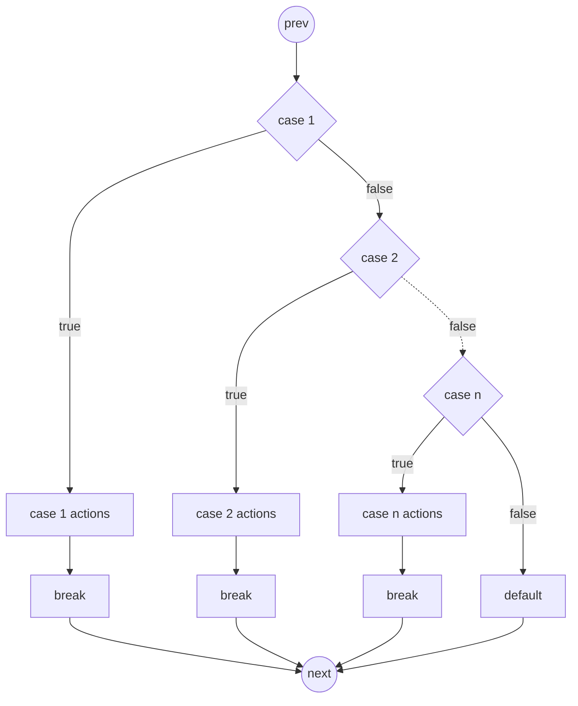
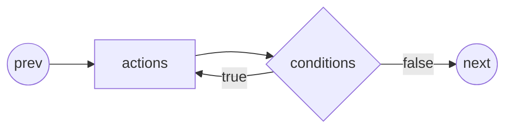
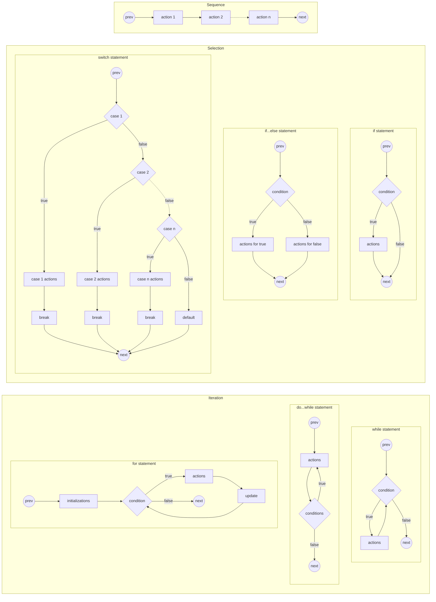

__Program Control__

_chtp9e ch4_


Iteration control
---
- by loop-continuation condition with a _control variable_ 
  - $⏰ ⋈ Threshold$, counter-controlled iteration
  - $🛂 ⋈ 🚦$, sentinel-controlled iteration
  - ⋈ is a relational operator
- iteration can be interrupted by
  - _continue_ and _break_


Counter-Controlled Iteration
---
```c
#include <stdio.h>

int main(void) {
   int counter = 1; // ❶ initialize

   while (counter <= 5) { // ❷ condition
      printf("%d  ", counter);
      ++counter; // ❸ update
   }

   puts("Done!");
}
```
- use integer counters
- don't use floating-point values which may be approximate


for Iteration Statement
---
```c
#include <stdio.h>
int main(void) {
   for (int counter = 1; // ❶ initialize
   counter <= 5; // ❷ condition
   ++counter) // ❸ update
   {
      printf("%d  ", counter);
   }

   puts("Done!"); 
}
```

📝 Practice
---
- draw the flowchart of the code above


Errors and special cases of iteration
---
- control variables (CVs) defined in a for header exist only until the loop terminates
  - accessing the CVs is a compilation error
- a logic error called an _off-by-one_ error: counter<5
- Infinite loops occur when the loop-continuation condition never becomes false
- Expressions in the for statement’s header are optional
   ```c
   // two infinite loops
   for(;;){;}

   while(true){;}
   ```
- Increment expression acts like a standalone statement


❓Questions
---
- Find the output of each for statement

```c
for (int i = 1; i <= 100; ++i) printf("%d\n", i);
for (int i = 100; i >= 1; --i) printf("%d\n", i);
for (int i = 7; i <= 77; i += 7) printf("%d\n", i);
for (int i = 20; i >= 2; i -= 2) printf("%d\n", i);
for (int j = 2; j <= 17; j += 3) printf("%d\n", i);
for (int j = 44; j >= 0; j -= 11) printf("%d\n", i);
```


Applications of the for statement
---
- Summing the even integers from 2 to 100
  - $\displaystyle S=∑_{n=2 | n +=2}^{100}n$
  ```c
  #include <stdio.h>

  int main(void)
  {
  int sum = 0;

  for (int number = 2; number <= 100; number += 2)
  {
      sum += number;
  }

  printf("Sum is %d\n", sum);
  }
  ```

- Compound-Interest Calculations
  - $a=p(1+r)^y$
  - Raise to power: [double pow (double base, double exponent)](https://cplusplus.com/reference/cmath/pow/)
  - [format string field width and alignment](https://cplusplus.com/reference/cstdio/printf/)
  ```c
  #include <stdio.h>
  #include <math.h>

  int main(void)
  {
    double principal = 1000.0;
    double rate = 0.05;

    printf("%4s%21s\n", "Year", "Amount on deposit");

    for (int year = 1; year <= 10; ++year)
    {

        double amount = principal * pow(1.0 + rate, year);
        // Formatting Numeric Output with field width
        printf("%4d%21.2f\n", year, amount);
    }
  }  
  ``` 

⚠️ Problems with floating numbers
---
```c
#include <stdio.h>
#include <math.h>

int main(void)
{
   // ❶ Displaying rounded values such as money
   // error accumulation and propagation
   double m1 = 15.323, m2 = 20.685; // internal values
   printf("m1=%.2f\nm2=%.2f\n", m1, m2); // rounded values
   printf("m1+m2=%.2f\n", m1+m2);

   // ❷ common dollar amounts can have
   // floating-point representational errors
   double d1 = 100.12, d2 = 99.01, d3 = 88.03;
   printf("d1 = %.15f\nd2 = %.15f\nd3 = %.15f\n", d1, d2, d3);
}
```


switch Multiple-Selection Statement
---
- counting letter grades
  - read character input with [int getchar ( void )](https://cplusplus.com/reference/cstdio/getchar/)
    - it returns the numerical representation of the character 
- EOF, end-of-file, normally equals -1, can be entered by
  - Ctrl+d, on Linux/MacOS
  - Ctrl+z, on Windows
```c
#include <stdio.h>

int main(void)
{
  int aCount = 0;
  int bCount = 0;
  int cCount = 0;
  int dCount = 0;
  int fCount = 0;

  puts("Enter the letter grades.");
  puts("Enter the EOF character to end input.");
  int grade = 0;
  // ❶ Read character input
  // Assignments have values
  while ((grade = getchar()) != EOF)
  {
    // ❷ show the input character
    printf("%c has the value %d.\n", grade, grade);
    switch (grade)
    {// ❸ handle legal grade letters
    case 'A': // 🄋 only constant integral expression can be tested
    case 'a':
        ++aCount;
        break;
    case 'B':
    case 'b':
        ++bCount;
        break;
    case 'C':
    case 'c':
        ++cCount;
        break;
    case 'D':
    case 'd':
        ++dCount;
        break;
    case 'F':
    case 'f':
        ++fCount;
        break;
    case '\n': // ❹ ignore newline, tab and blank characters
    case '\t':
    case ' ':
        break;
    default:
        printf("%s", "Incorrect letter grade entered.");
        puts(" Enter a new grade.");
        break;
    }
  }

  puts("\nTotals for each letter grade are:");
  printf("A: %d\n", aCount);
  printf("B: %d\n", bCount);
  printf("C: %d\n", cCount);
  printf("D: %d\n", dCount);
  printf("F: %d\n", fCount);
}
```

- a character set and its numeric values are defined in ASCII (American Standard Code for Information Interchange)   
   - ASCII is a subset of Unicode


❓Questions
---
- How is the following expression evaluated?
  ```c
  a = b = c = 10;
  ```
  - = is right associate, evaluated from right to left
  - returns the value of the lhs


switch Statement Flowchart
---



📝 Practice
---
- [Integer types and range of values](https://en.cppreference.com/w/c/language/arithmetic_types)


🔭 Explore
---
- [Signed number representations](https://en.wikipedia.org/wiki/Signed_number_representations#Sign-and-magnitude_method)


🔭 Explore
---
- [Integer constant](https://en.cppreference.com/w/c/language/integer_constant)
- [Constant expressions](https://en.cppreference.com/w/c/language/constant_expression)
- [Comma operator](https://en.wikipedia.org/wiki/Comma_operator)


do...while iteration statement
---
- loop actions before testing loop condition
  - find the output of the program below
```c
#include <stdio.h>

int main(void){
  int counter = 1;

  do{
    printf("%d ", counter);
  }while(++counter <= 5)
}
```

- do...while statement flowchart




break and continue statements
---
- break and continue statements are used to alter program flow
  - break jumps out of the iteration or switch block contains it
    - used in while, for, do...while, or switch statement
    - jump to the statement following the breaking block
  - continue jumps to the beginning of the iteration block contains it
    - used in while, for, or do...while statement
    - jump to the loop condition test in while and do...while
    - jump to the update statement then the loop-condition test in for


💡 Demo: find program output
---
- break iteration
```c
#include <stdio.h>
int main(void)
{
   int x = 1;
   for (; x <= 10; ++x)
   {
      if (x == 5)
      {
         break; // ⤵️
      }
      printf("%d ", x);
   } /* ⦿ */ 
   printf("\nBroke out of loop at x == %d\n", x);
}
```
- continue iteration
```c
#include <stdio.h>
int main(void)
{
   for (int x = 1; x <= 10; /* ⦿ */ ++x)
   {
      if (x == 5)
      {
         continue; // ⤴️
      }
      printf("%d ", x);
   }
   puts("\nUsed continue to skip printing the value 5");
}
```

Logical operators
---
- used to build complex condition statement
- three logical operators
  - logical and: `&&`
    - `e1 && e2`: to be true both e1 and e2 must be true
  - logical or: `||`
    - `e1 || e2`: to be false both e1 and e2 must be false
  - logical not: `!`
    - `!c` : negate the truth of c
    - `!(a==b)` is equivalent to `a != b`
- short-circuit evaluation 
  - evaluates the and/or statement from left to right
  - stops moving rightward if the truth is determined
    - `e1 && e2 && ... && en` stops at the first false expression
    - `e1 || e2 || ... || en` stops at the first true expression
  - improves performance by skipping the rest
- precedence
  - `! ▷ <,<=,>,>= ▷ ==, != ▷ && ▷ || ▷ =`


Boolean literals
---
- _Bool is the keyword for a boolean type
- bool, defined in `<stdbool.h>` is a shorthand of _Bool
- a boolean variable holds only two possible values: 0 or 1
  - value 0 is false
  - any nonzero value is true
  - 0 is defined as false, 1 as true in `<stdbool.h>`


Equality (==) vs. assignment (=)
---
- misusing equality and assignment causes runtime logic errors
  - `x=7` vs. `x==7`
  - `x=y` vs. `x==y`
- lvalues (left values) can be used as lhs and rhs of =
- rvalues (right values) can be used only as rhs of =
- a tip: 
  - `7==x` can't be confused with `7=x` since `7=x` causes a syntax error


Three forms of basic controls
---
- sequence
  - `action 1; action 2; ...; action n`
- selection
  - if statement (single selection)
    - `if(condition){actions}`
  - if...else statement (double selection)
    - `if(condition){actions for true}else{actions for false}`
  - switch statement (multiple selection)
   ```c
   switch(x){
    case 1:
      case 1 actions;
      break;
    case 2:
      case 2 actions;
      break;
    ...
    case n:
      case n actions;
      break;
    default:
      default actions;
   }
   ```
- iteration
  - while statement
    - `while(condition){actions}`
  - do...while statement
    - `do{actions}while(condition)`
  - for statement
    - `for(initializations; condition; updates){actions}`





Build programs using basic controls
---
- ⚠️ Any C program can be expressed with only 
  - three forms of control
    - sequence, if statement and while statement
    - consider control as compound action
  - in only two ways:
    - stacking: put controls in sequence 
    - nesting: any action can be replaced by any control


📝 Practice: secure C programming
---
- check function scanf's return value
- check the range of physical quantity
  - valid age in years
  - valid height in centimeters, etc.


🔭 Explore
---
- [statements](https://en.cppreference.com/w/c/language/statements)
- [Logical operators](https://en.cppreference.com/w/c/language/operator_logical)
- [C Operator Precedence](https://en.cppreference.com/w/c/language/operator_precedence)